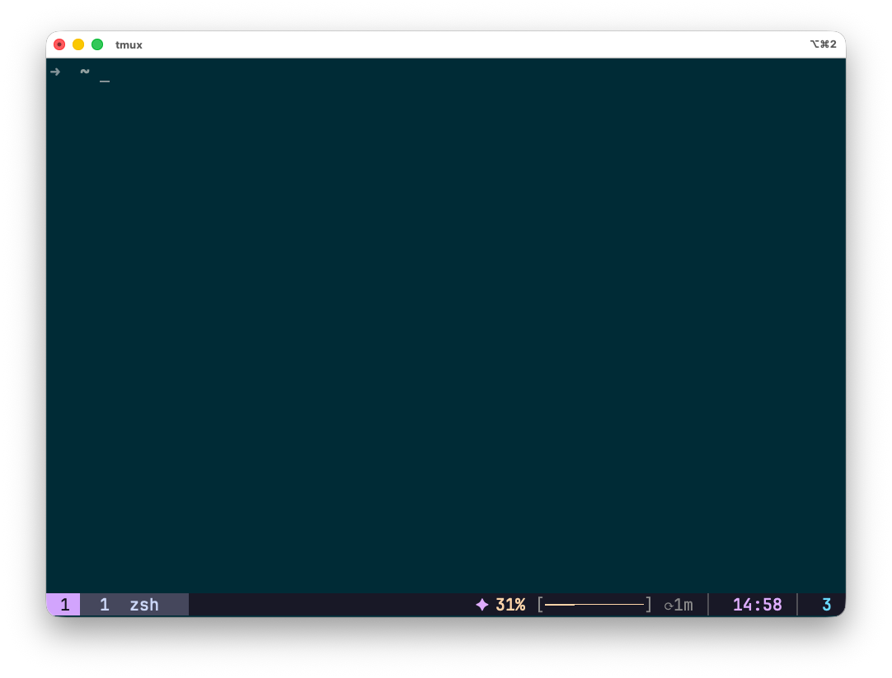

<p align="center">
  <h1 align="center">✦ Claude tmux status</h1>
  <p align="center">Display your Claude.ai usage in tmux status bar</p>
  <p align="center">
    <a href="https://github.com/Tonours/claude-tmux-status/actions/workflows/test.yml">
      
    </a>
  </p>
</p>

<p align="center">
  
</p>

<p align="center">
  <code>✦ 31% [━━━───────] ⟳2m</code>
</p>

---

## ✨ Features

- 📊 **Real-time usage** — See your Claude.ai quota at a glance
- 🎨 **Catppuccin colors** — Beautiful gradient from green to red
- ⏱️ **Reset timer** — Know when your quota resets
- 💾 **Smart caching** — Avoid API spam with 30s cache
- 🐍 **Python powered** — Works on macOS & Linux

## 📦 Installation

```bash
git clone https://github.com/Tonours/claude-tmux-status.git
cd claude-tmux-status
./install.sh
```

<details>
<summary>📥 Manual installation</summary>

```bash
mkdir -p ~/.local/bin
curl -sL https://raw.githubusercontent.com/Tonours/claude-tmux-status/main/claude-usage.sh -o ~/.local/bin/claude-usage.sh
curl -sL https://raw.githubusercontent.com/Tonours/claude-tmux-status/main/tmux-status.sh -o ~/.local/bin/tmux-claude-status.sh
chmod +x ~/.local/bin/claude-usage.sh ~/.local/bin/tmux-claude-status.sh
```

</details>

## 🔧 Setup

### 1. Get your credentials

| Credential | How to get it |
|------------|---------------|
| **Session Key** | Open [claude.ai](https://claude.ai) → DevTools (F12) → Application → Cookies → `sessionKey` |
| **Organization ID** | Go to Settings → Organization → Copy UUID from URL |

### 2. Run the setup wizard

```bash
claude-usage.sh setup
```

### 3. Add to tmux config

```bash
# ~/.tmux.conf
set -g status-right "#(~/.local/bin/tmux-claude-status.sh)"
set -g status-interval 30
```

### 4. Reload tmux

```bash
tmux source-file ~/.tmux.conf
```

## 🎨 Color Scale

| Usage | Color | Status |
|:-----:|:-----:|:------:|
| 0-30% | 🟢 Green | You're good |
| 30-50% | 🟡 Yellow | Moderate use |
| 50-70% | 🟠 Peach | Getting there |
| 70-90% | 🔶 Orange | Slow down |
| 90-100% | 🔴 Red | Almost out |

## ⚙️ Configuration

Environment variables for customization:

```bash
export CLAUDE_USAGE_CONFIG="~/.config/claude-usage/config"  # Config path
export CLAUDE_USAGE_CACHE="~/.config/claude-usage/cache"    # Cache path
export CLAUDE_USAGE_CACHE_TTL="30"                          # Cache TTL (seconds)
```

## 🧪 Testing

```bash
# Run tests
./test.sh

# Test individual components
claude-usage.sh          # Should output: <number>|<timestamp>
tmux-claude-status.sh    # Should output tmux-formatted string
```

## 🐛 Troubleshooting

| Error | Solution |
|-------|----------|
| `ERROR:NO_CONFIG` | Run `claude-usage.sh setup` |
| `ERROR:HTTP_403` | Session key expired, get a new one |
| `ERROR:NETWORK` | Check your internet connection |
| `claude: ?` | Script not found in PATH |
| `claude: -` | API error, check credentials |

## 📋 Requirements

- Python 3 (pre-installed on macOS/Linux)
- Bash
- tmux
- curl (for manual install only)

## 📄 License

MIT

---

<p align="center">
  Made with ✦ for Claude users
</p>
